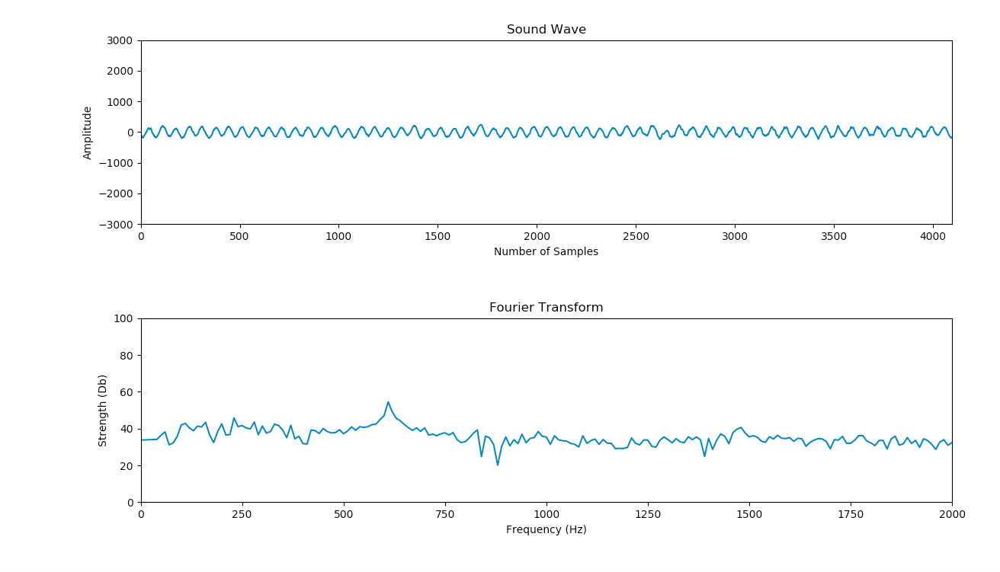
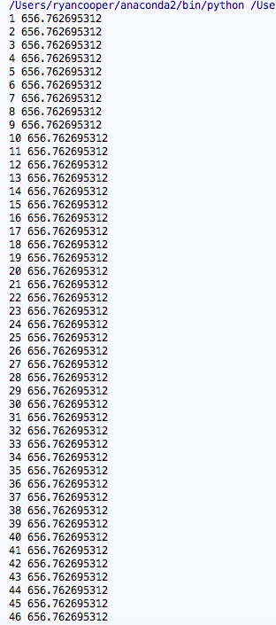

<h2 style = "text-align:center;">Homework 3</h2>
<h3>Planned Work</h3>

The work I outlined in the project proposal was the following:

Start with back-end development. Use pyaudio to take in a user sound input. Use Fourier transform on this input and then display data using python's plotting libraries.

<h3>Accomplished Work</h3>

I accomplished everything I planned to do for this assignment. I downloaded the Pyaudio library and learned the basics of how to record user sound input and what different signal processing terms mean. I then experimented with real-time audio input vs. "batch" input methods. I ultimately decided that it may be difficult to accomplish real-time analysis over the web. Further, my goal outside of this class is to work on complete transcription and not just note recognition, and this requires the use of fret prediction algorithms. These algorithms may struggle to run in real-time with a Python back-end, and an accurate degree of transcription is of more importance to the user than slightly more instantaneous results.

After getting user sound input to function properly, I worked on using a Fourier Transform on the input to analyze the data. Since the stream of sound data is initially in a binary form, I had to first convert it to integer form. The program currently returns a graph of the last recorded sound wave to the user which appears as one would expect a sound wave to appear. Next, the Fourier Transform was applied to the integer data using the Numpy library. The transformed data was graphed and displayed to the user and appeared visually how one would expect a Fourier Transform to appear. Finally, the highest frequency was extracted from the Fourier Transform and displayed to the user for each sound sample taken.

<h3>Plan for Next Assignment</h3>

After completing the current assignment, I feel that I can be slightly more ambitious then originally expected for the next assignment. I originally intended to spend both Homework 4 and Final Checkpoint 1 working on breaking the sound data into individual notes and assigning a pitch to those notes. Since I am already able to get frequency data from the sound input, the main focus of the next assignment will be determining where a note starts and ends.

With that being said, my goal for Assignment 4 is to break the sound data into individual notes, correspond these notes to a particular pitch, and to begin front-end development by setting up a basic HTML page and learning how to take user input through a button in JavaScript.

<h3>Current State of Project</h3>

To test my project I used the following video which plays a constant E note at 659.26 hz.

</img>

The following plots show the results of playing this video while running the program:

</img>

It can be seen that the sound wave appears fairly constant, as would be expected of a constant tone. The slight discrepancies can be explained by the background noise from the environment.

The Fourier Transform plot shows what would be expected, with the maximum peak centered around the frequency played by the video.

 The final image below is the console output from running the program while the video was playing. The numbers in the first column correspond to the sample number, which are taken every 1/44100 of a second. The second column corresponds to the strongest frequency recorded. It can be seen that the output is only off by about 3 Hz from the signal claimed by the video. This shows that the program is fairly accurate for audio analysis.

</img>
