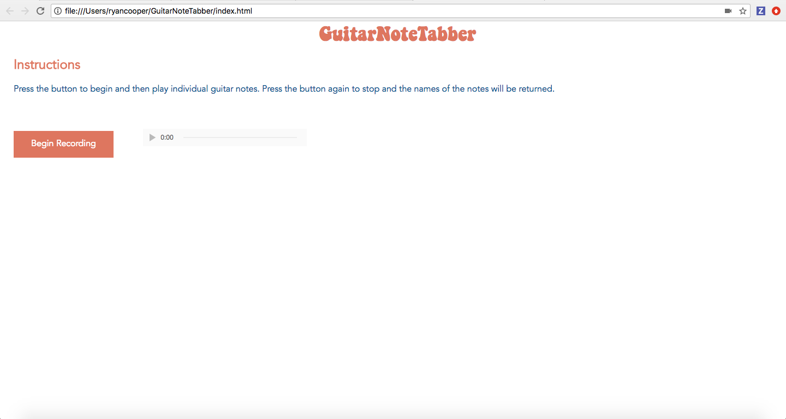
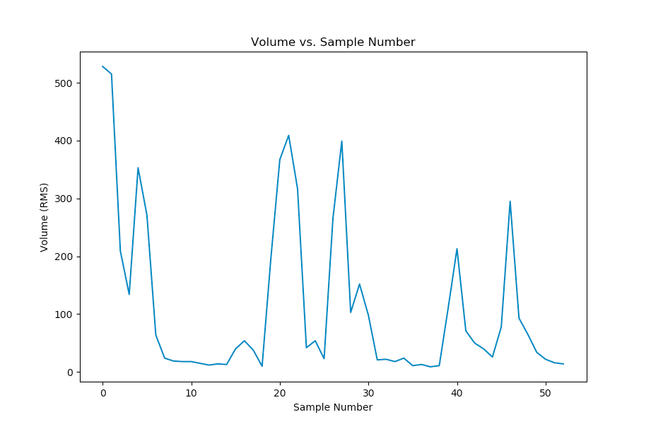
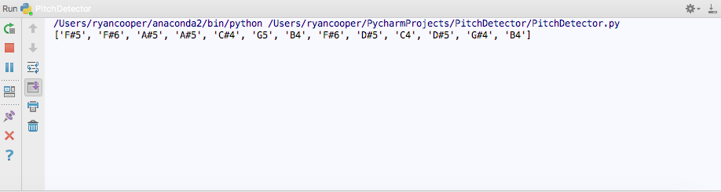

<h2 style = "text-align:center;">Homework 4</h2>
<h3>Planned Work</h3>

The work I outlined in the previous assignment was the following:

Break the sound data into individual notes, correspond these notes to a particular pitch, and to begin front-end development by setting up a basic HTML page and learning how to take user input through a button in JavaScript.

<h3>Accomplished Work</h3>

I accomplished everything I planned to do for this assignment. I took the frequency returned from each sound sample and used binary search to correspond the frequencies with the note of a particular pitch. I then wrote an algorithm that takes the notes and volumes of all the sound samples and determines which notes should be returned to the user. This was accomplished by looking at the volume samples and finding the peaks in the volume since a string being plucked will correspond to a peak in volume. It was then checked that the peak was greater than 1000 rms since from testing it was found that even quietly playing a string will yield this volume. This helps to eliminate unnecessary background noise.

On the front-end, I set up a basic page using HTML and CSS with use instructions and a button to control the recording. I then used the getUserMedia and MediaRecorder APIs in JavaScript to record user audio input through the browser. For testing purposes, I converted this audio into a blob that could be played back to the user through an HTML audio element.

<h3>Plan for Next Assignment</h3>

For the next assignment, I will connect the front-end to the back-end by sending user audio data recorded in the browser to the back-end for processing. I will accomplish this by using the Python web framework, Flask. I will also work more on increasing the accuracy of the note-picking algorithm as this function determines how accurate the output will be to the user.

<h3>Current State of Project</h3>

This is the current webpage. When the "Begin Recording" button is pressed, the browser begins recording the audio input through the microphone. The button text also changes to "Stop Recording." When stop recording is pressed, the audio element is given the recording and the user can play it back. In the future, the notes played will be displayed below the recording button.

This is an example output of the back-end measuring the volume of each sample. This is the data that the peaks are calculated from in order to pick out individual notes.

This is the corresponding note data outputted from the graph above. It can be seen that the number of notes matches the number of peaks on the graph. 

