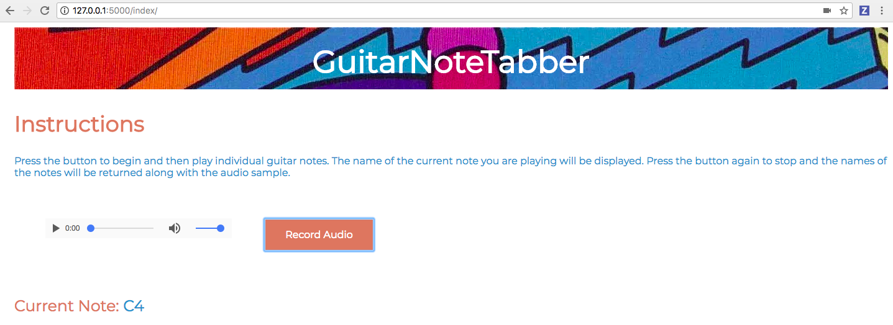
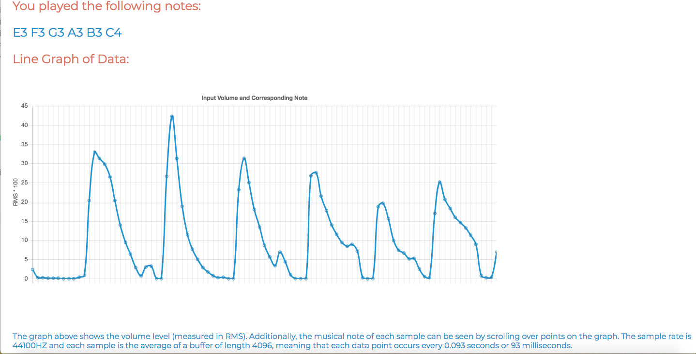

<h2 style = "text-align:center;">Final Submission</h2>
<h3>Planned Work</h3>

After struggling to convert the sound data to the correct format
during the last assignment, my goal for this checkpoint was to switch from
the MediaRecorder API to a different API in order to take in sound data. I then
aimed to modify that data and the back-end functions for analysis.

<h3>Accomplished Work</h3>

After switching from the MediaRecorder API to the WebAudioAPI, I was
able to take in raw Float32 sound data and pass it to the back-end
through an HTTP request. I then reimplemented the MediaRecorder WebAudioAPI
in order to maintain the ability to playback audio to the user. Because
the back-end originally took in Int16 sound data, I had to make some
adjustments to the code in order to work with Float32. Additionally,
I wrote a new function to calculate RMS as the old one was intended for
integer data. I made these
changes and then modified all the functions so that the back-end worked properly.

After the back-end was working properly, I began to make adjustments to the
front-end. I adjusted the code to properly display the string of notes returned to the user.
After that, I added some minor visual changes. I also added a graph of volume
and note data to the front-end by sending the list of notes and RMS values
via HTTP. I inputted these values to ChartJS in order to display to the user the
data visually.

The final changes I made were to modify the algorithm to not just pick the note
at volume peaks, but to survey the next succession of notes and pick the most frequent one.

<h3>Plan for Next Assignment</h3>

My plan for the future is to switch to a different note detection algorithm than
just Fourier Transforms. The main draw of this is that although the program works,
it can predict notes incorrectly because of the complexity of guitar sounds. A note
on the guitar has a fundamental frequency that determines its note but can also have
harmonics that are as loud or louder than the fundamental frequency. This can cause the
Fourier transform to return improper readings. By switching to a different algorithm, I hope to minimize
these inaccuracies. Algorithms suggested online include Autocorrelation, and the Yin algorithm.

Additionally, I plan to deploy this project on my website. I am in the process of
doing this but need to acquire an SSL certificate as sound recording is only available
over localhost and https.

<h3>Current State of Project</h3>

This is the current web-page. I changed some fonts and colors for the sake of appearance.
The record button when pressed, records the audio and then when pressed again, sends it
to the back-end for processing. The "Current Note" section displays the note in real-time
that is currently being played by the user. Upon finished recording, the user can
playback the audio through the audio element.

This is an example output of the program. To demonstrate the program, I played part of a major
scale starting on the first string and ending on the second string. It can be seen that the
program accurately returned all notes played. The graph below shows the volume of the recording
at each sample. Additionally, by hovering over the samples, the user can see what note was read
at each point. It can be seen that there is a very obvious spike in volume for each note played
and by scrolling over the samples around the peaks, it can be seen that the program accurately
calculates the note at each point.

