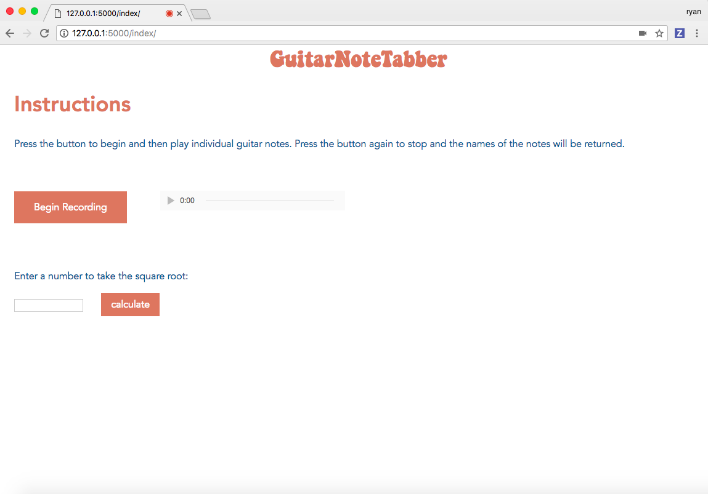
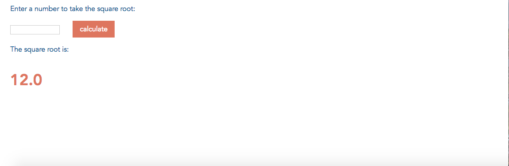
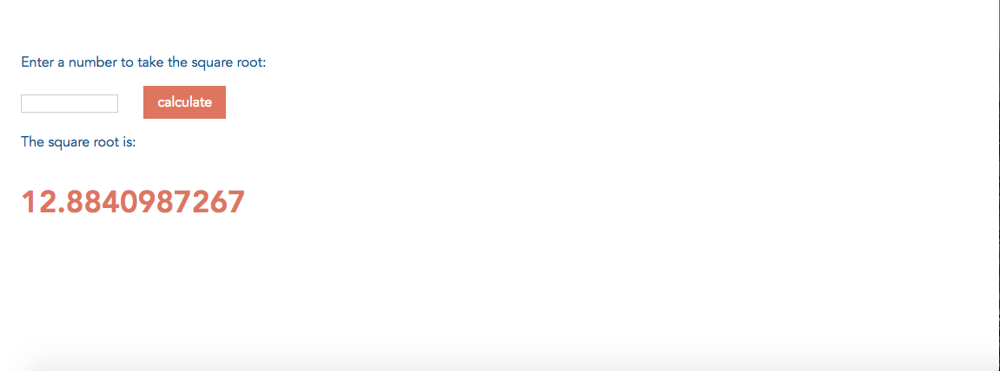

<h2 style = "text-align:center;">Final Project Checkpoint 1</h2>
<h3>Planned Work</h3>

My plan for this assignment was to choose a Python web-framework and then connect my front-end to a back-end file. Because of the short checkpoint, my goal was not to completely connect my back-end audio analysis file but to simply connect to some python file to demonstrate the framework.

<h3>Accomplished Work</h3>

I accomplished everything I proposed for this checkpoint. I chose to use Flask for this project as it is know for being more light-weight than Django and I don't need a very intensive framework for this particular project.

The first step was creating a template of the current static HTML file from this project. This was fairly easy to accomplish in Flask and required placing the HTML and CSS into the appropriately named folders required by Flask and changing the URL of the stylesheet in the HTML file. Next, I created a form in HTML and added the "POST" method to this form, indicating that the information in the form should be posted to the server upon the submit button being pressed. Finally, I added a handler for the POST method in the Python file. This function converts the string input to a float, takes the square root of the number, and then converts back to a string to return to the HTML. Upon returning the square root of the number, the HTML file displays the output to the user using a Jinja template.

<h3>Plan for Next Assignment</h3>

For the next assignment, I will connect my front-end to my back-end audio analysis file using Flask. This will involve determining what format is needed to send the audio data from the front-end to the back-end. I will also have to figure out how to accept this audio data on the back-end, feed it into the necessary functions, and then return the output to the front-end as a string of notes.

If I have additional time, I will work on fine tuning the note detection algorithm. From my testing it is fairly accurate but could likely be slightly improved, possibly by checking the current note against adjacent notes.

<h3>Current State of Project</h3>

This is the current web-page. It can be seen that all the previous functionality and design is still included as the static HTML page was adapted into a template to use with Flask. The new form instructs the user to enter a number to take the square root and contains a "calculate" button to submit the input.

This is the result of the user entering "144" and clicking the calculate button. It can be seen that the new text appears from the template, and the square root is accurately calculated by sending the input to the server.

This is the result of entering "166" and clicking the calculate button. Again, it can be seen that the square root is accurately calculated by the server and returned to the user. It should be noted that neither the front-end or back-end confirm that the user input was actually number, so if unusual inputs, like negative numbers or strings are entered, the webpage will yield an error.

