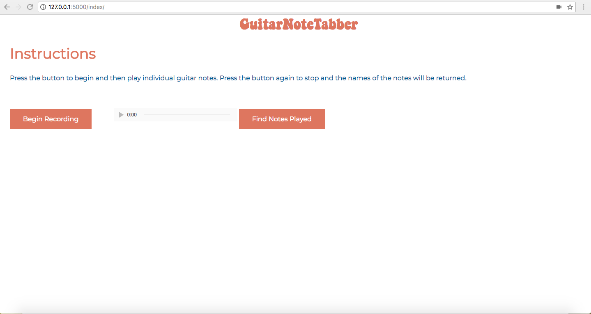
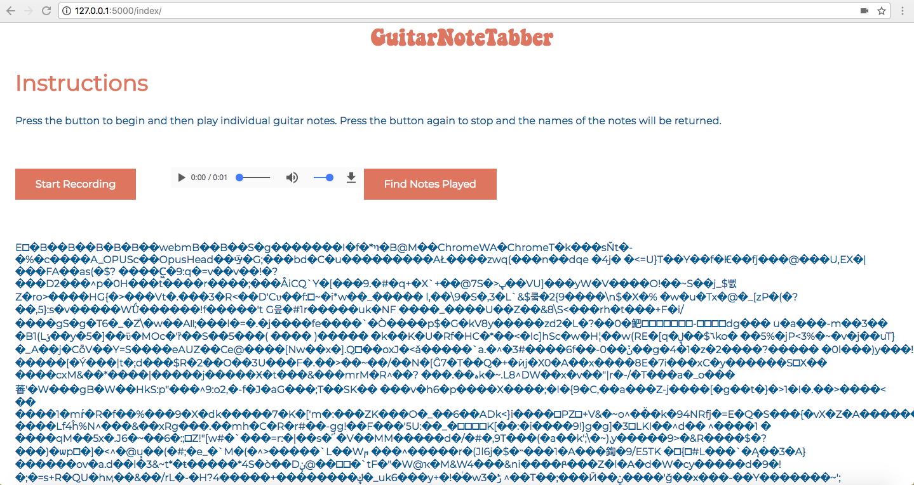

<h2 style = "text-align:center;">Final Project Checkpoint 2</h2>
<h3>Planned Work</h3>

My plan for this assignment was to connect my front-end and back-end, convert the audio data to a proper format that can be passed to the back-end and then pass that data to the proper functions and return the string to the user.

<h3>Accomplished Work</h3>

I struggled to accomplish what I intended to for this assignment. First I was having difficulty sending the audio data from the front-end to the back-end using AJAX. I assumed that AJAX requests would behave in the same manner as using a form to post data like I did in the last assignment. Eventually I realized that I need to use a callback within the AJAX function to handle the data returned from the server and add it to the HTML page. I implemented this and am now able to send audio from the recording to the back-end and then print it on the front-end.

The next issue I encountered is that it is much more difficult than expected to convert the audio data from the front-end to the correct format. The MediaRecorder API which I have been using to record the audio stream from GetUserMedia yields a blob of data that is packaged in a Webm file format and contains encoded audio data. This data cannot be simply converted to an int like the back-end and I am not sure how to extract the raw audio data from this file after a large deal of research. I have since decided to move in a different direction, by either using a different API (perhaps RecorderJS), or by creating my own recording mechanism using the WebAudio API. I also need to do more research into the different ways that sound data can be represented in a file in order to sync my front-end and back-end.

<h3>Plan for Next Assignment</h3>

For the next assignment, I will try to find a different API to use to pass audio data from the front-end to the back-end, and if the existing APIs don't function properly, I will have to write my own code to record raw sound data from the audio stream generated by GetUserMedia. Once the sound data is in the correct format, I will have to make small modifications to the back-end to properly run the right functions to determine the notes.

<h3>Current State of Project</h3>

This is the current webpage updated from last time. I removed the test form that calculated the square root to demonstrate front-end/ back-end connectivity. I then added the "Find Notes Played Button" and got it to send the sound data recorded to the back-end.

This is an example of what occurs when the user records audio and then sends it to the back-end. As it is set up now, the back-end simply returns the audio from the front-end. The data displayed is the Blob data in audio/webm format. I am having trouble converting this data to the right format which may cause me to switch to a different method for recording audio on the front-end.

